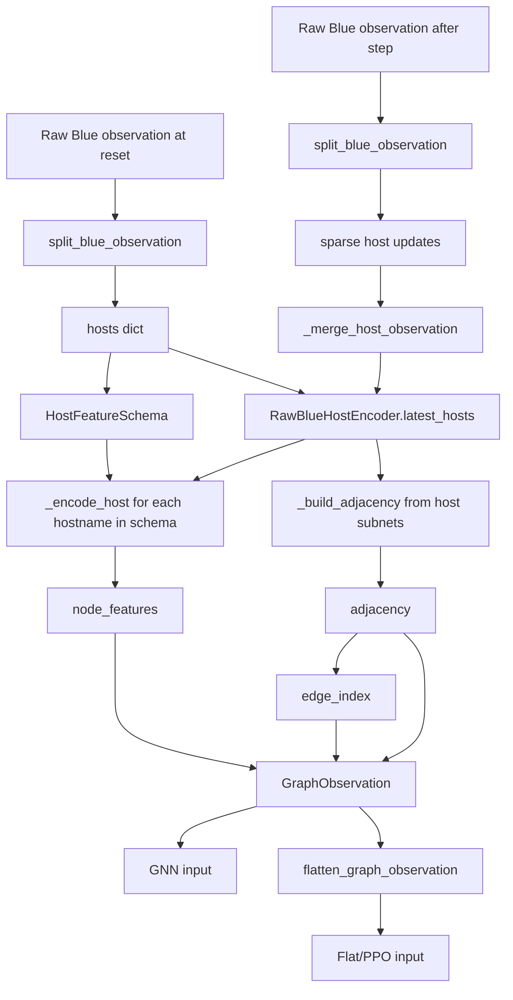

# host_obs.py pipeline

```mermaid
flowchart TD
    A["Raw Blue observation at reset"] --> B["split_blue_observation"]
    B --> C["hosts dict"]
    C --> D["HostFeatureSchema"]
    C --> E["RawBlueHostEncoder.latest_hosts"]

    F["Raw Blue observation after step"] --> G["split_blue_observation"]
    G --> H["sparse host updates"]
    H --> I["_merge_host_observation"]
    I --> E

    E --> J["_encode_host for each hostname in schema"]
    D --> J
    J --> K["node_features"]

    E --> L["_build_adjacency from host subnets"]
    L --> M["adjacency"]
    M --> N["edge_index"]

    K --> O["GraphObservation"]
    M --> O
    N --> O

    O --> P["GNN input"]
    O --> Q["flatten_graph_observation"]
    Q --> R["Flat/PPO input"]
```
